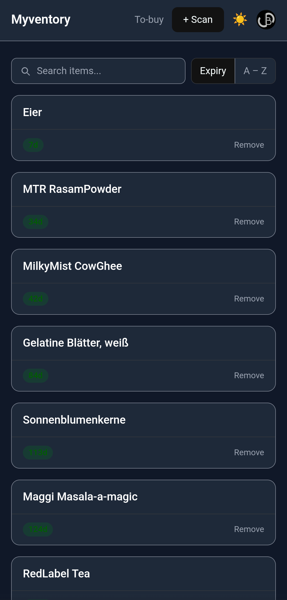
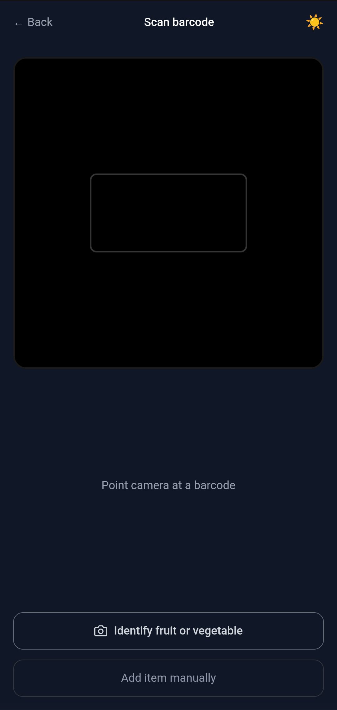
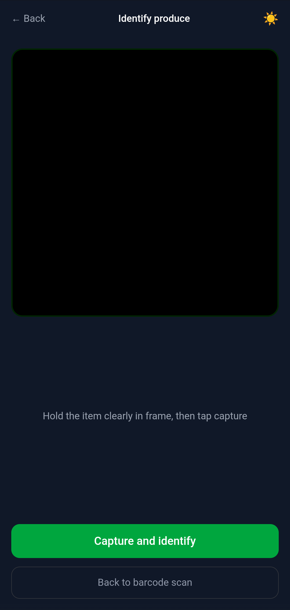
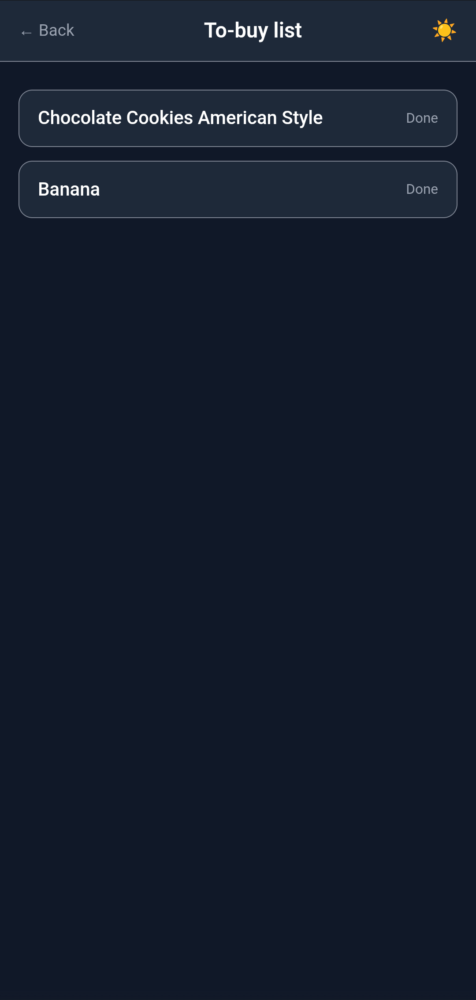
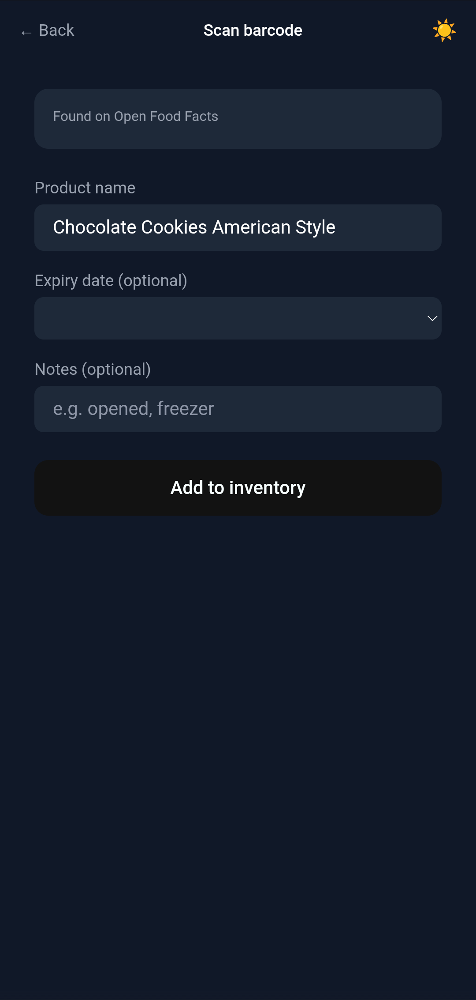
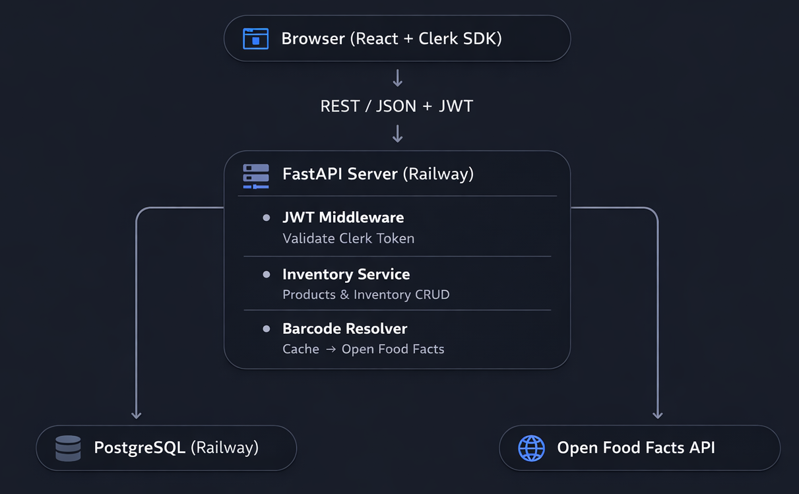

# Myventory

> A household inventory management app for tracking perishable items and expiry dates. Built with FastAPI, React, and PostgreSQL.


---

## Table of Contents

- [Myventory](#myventory)
  - [Table of Contents](#table-of-contents)
  - [Overview](#overview)
  - [Live Demo](#live-demo)
  - [Screenshots](#screenshots)
  - [Features](#features)
    - [Implemented (v1.0)](#implemented-v10)
  - [Tech Stack](#tech-stack)
  - [Architecture](#architecture)
    - [Auth flow](#auth-flow)
    - [Barcode scan flow](#barcode-scan-flow)
    - [Produce identification flow](#produce-identification-flow)
  - [Database Schema](#database-schema)
    - [`households`](#households)
    - [`users`](#users)
    - [`products`](#products)
    - [`inventory_items`](#inventory_items)
    - [`to_buy_items`](#to_buy_items)
  - [API Reference](#api-reference)
  - [Project Structure](#project-structure)
  - [Getting Started](#getting-started)
    - [Prerequisites](#prerequisites)
    - [1. Clone the repository](#1-clone-the-repository)
    - [2. Backend setup](#2-backend-setup)
    - [3. Frontend setup](#3-frontend-setup)
  - [Deployment](#deployment)
    - [Backend (Railway)](#backend-railway)
    - [Frontend (GitHub Pages)](#frontend-github-pages)
  - [Known Limitations](#known-limitations)
  - [Further Improvements](#further-improvements)
    - [Stabilisation](#stabilisation)
    - [Features](#features-1)
    - [Scale](#scale)
  - [Contributing](#contributing)
  - [License](#license)

---

## Overview

Myventory is a publicly deployed personal project web-app that helps households track perishable items like snacks, groceries, fruits and vegetables - and when they expire. Users can add items in three ways: scan a product barcode using their phone camera, photograph a fruit or vegetable for automatic identification, or type the name manually. Each physical unit is tracked individually with its own expiry date, enabling precise first-expiry-first-out visibility.

Multiple independent households can sign up and use the app. All data is fully isolated per household. When items run low or are consumed, they can be moved to a shared to-buy list with a single tap.

---

## Live Demo

**Frontend:** [https://sanchitbahl.github.io/myventory](https://sanchitbahl.github.io/myventory)

**API Docs:** [https://myventory-production.up.railway.app/docs](https://myventory-production.up.railway.app/docs)

> Sign in with a Google account to get started. A household is created automatically on first login.

---

## Screenshots


| Inventory page | Scan page | Produce identification | To-buy list | Scan confirm |
|---|---|---|---|---|
|  |  |  |  |  |

---

## Features

### Implemented (v1.0)

- **Google login** via Clerk — no passwords, sign in with your Google account
- **Multi-household support** — each household has a fully isolated inventory
- **Barcode scanning** — scan any EAN-13 or UPC-A barcode using the device camera
- **Automatic product lookup** — product names resolved from Open Food Facts, a free public database covering millions of products
- **Produce identification** — photograph a fruit or vegetable and MobileNet (TensorFlow.js) identifies it from 80+ supported classes. Runs entirely in the browser, no server round-trip (known accuracy issue, prioritized speed)
- **Manual entry** — add any item by name directly, bypassing the camera entirely. Available as a fallback on the scan screen
- **Editable product names** — pre-filled names from Open Food Facts or MobileNet can be edited before saving
- **Per-unit expiry tracking** — each physical unit has its own expiry date (e.g. three cartons of milk each tracked separately)
- **Expiry badges** — colour-coded: green for fine, amber for expiring within 3 days, red for expired
- **Edit expiry dates** — tap any expiry badge to change or clear the date after adding
- **Search bar** — filter inventory by product name in real time
- **Sort toggle** — switch between expiry-first and alphabetical (A–Z) ordering
- **To-buy list** — when removing an item, choose to move it to the to-buy list. Separate dedicated page
- **Dark / light mode** — defaults to dark mode, toggle persists across sessions
- **Skeleton loading states** — throughout all pages


---

## Tech Stack

| Layer | Technology |
|---|---|
| Frontend | React 19, Tailwind CSS v4, Vite |
| Auth | Clerk (Google OAuth, JWT) |
| Barcode scanning | ZXing-js (`@zxing/browser`) |
| Produce identification | TensorFlow.js + MobileNet (in-browser, lazy loaded) |
| Routing | React Router v7 |
| Backend | Python, FastAPI, SQLAlchemy ORM |
| Database | PostgreSQL (production), SQLite (local dev) |
| External API | Open Food Facts |
| Frontend hosting | GitHub Pages (via GitHub Actions) |
| Backend hosting | Railway |
| CI/CD | GitHub Actions |

---

## Architecture

The system follows a standard three-tier web architecture inside a single monolithic FastAPI server.



### Auth flow

1. User visits the app → Clerk redirects to Google sign-in
2. Google authenticates the user → Clerk issues a JWT
3. Frontend calls `POST /api/auth/sync` — backend creates household and user on first login
4. All subsequent API calls include `Authorization: Bearer <token>`
5. FastAPI's `get_current_user` dependency validates the token and injects `household_id` into every endpoint

### Barcode scan flow

1. ZXing-js decodes the barcode from the camera
2. Frontend calls `GET /api/barcode/{barcode}`
3. Backend checks household product catalogue first (cache hit = instant, no external call)
4. Cache miss → calls Open Food Facts API
5. Returns product name or `not_found`
6. User confirms/edits name and sets expiry date
7. Frontend calls `POST /api/products` (if new) then `POST /api/inventory`

### Produce identification flow

1. User taps "Identify fruit or vegetable"
2. TensorFlow.js and MobileNet load from CDN on first use (~8MB, cached by browser after)
3. User frames the item and taps "Capture and identify"
4. A still frame is captured from the video feed
5. MobileNet classifies the image and the top prediction is matched against 80+ fruit/veg keywords
6. Matched name is pre-filled (editable) on the confirm screen
7. Standard `POST /api/products` + `POST /api/inventory` flow follows

---

## Database Schema

Five tables:

### `households`
| Column | Type | Notes |
|---|---|---|
| id | INTEGER PK | Auto-increment |
| name | TEXT | Default: email prefix on first login |
| created_at | TIMESTAMP | Auto-set |

### `users`
| Column | Type | Notes |
|---|---|---|
| id | TEXT PK | Clerk user ID (e.g. `user_2abc...`) |
| email | TEXT | Synced from Clerk |
| household_id | INTEGER FK | → households.id |
| created_at | TIMESTAMP | Auto-set |

### `products`
| Column | Type | Notes |
|---|---|---|
| id | INTEGER PK | Auto-increment |
| household_id | INTEGER FK | → households.id |
| barcode | TEXT | Nullable, unique per household |
| name | TEXT | From Open Food Facts, MobileNet, or manual entry |
| created_at | TIMESTAMP | Auto-set |

### `inventory_items`
| Column | Type | Notes |
|---|---|---|
| id | INTEGER PK | Auto-increment |
| product_id | INTEGER FK | → products.id |
| expires_at | DATE | Nullable, editable after adding |
| added_at | TIMESTAMP | Auto-set |
| notes | TEXT | Nullable (e.g. "opened", "freezer") |

### `to_buy_items`
| Column | Type | Notes |
|---|---|---|
| id | INTEGER PK | Auto-increment |
| household_id | INTEGER FK | → households.id |
| product_id | INTEGER FK | → products.id |
| added_at | TIMESTAMP | Auto-set |
| notes | TEXT | Nullable |

---

## API Reference

All endpoints require `Authorization: Bearer <clerk_jwt>`. Full interactive docs at `/docs`.

| Method | Path | Description |
|---|---|---|
| GET | /health | Health check |
| POST | /api/auth/sync | First-login bootstrap |
| GET | /api/household | Get current household |
| PATCH | /api/household | Rename household |
| GET | /api/barcode/{barcode} | Resolve barcode (cache → Open Food Facts) |
| GET | /api/products | List household products |
| POST | /api/products | Create a product |
| GET | /api/products/{id} | Get product with all units |
| PATCH | /api/products/{id} | Update product name |
| DELETE | /api/products/{id} | Delete product and all units |
| GET | /api/inventory | List inventory grouped by product |
| POST | /api/inventory | Add one unit |
| PATCH | /api/inventory/{id} | Update expiry date or notes |
| DELETE | /api/inventory/{id} | Remove a unit |
| GET | /api/to-buy | List to-buy items |
| POST | /api/to-buy | Add item to to-buy list |
| DELETE | /api/to-buy/{id} | Remove item from to-buy list |

---

## Project Structure

```
myventory/
├── .github/
│   └── workflows/
│       └── deploy-frontend.yml    ← Auto-deploys frontend to GitHub Pages on push
├── backend/
│   ├── main.py                    ← FastAPI app entry point
│   ├── database.py                ← DB engine and session management
│   ├── models.py                  ← SQLAlchemy ORM models (5 tables)
│   ├── auth.py                    ← Clerk JWT validation dependency
│   ├── schemas.py                 ← Pydantic request/response shapes
│   ├── routes.py                  ← All 17 API endpoints
│   ├── requirements.txt           ← Python dependencies
│   ├── Dockerfile                 ← Container definition for Railway
│   └── .env.example               ← Environment variable template
└── frontend/
    ├── src/
    │   ├── main.jsx               ← Entry point (Clerk + Router + Theme providers)
    │   ├── App.jsx                ← Route definitions and auth gating
    │   ├── api.js                 ← Fetch wrapper (attaches JWT to every request)
    │   ├── ThemeContext.jsx       ← Dark/light mode state
    │   ├── index.css              ← Tailwind import
    │   └── pages/
    │       ├── InventoryPage.jsx  ← Inventory list with search, sort, expiry editing
    │       ├── ScanPage.jsx       ← Barcode scan + produce identification + manual add
    │       └── ToBuyPage.jsx      ← To-buy list view
    ├── public/
    │   └── 404.html               ← GitHub Pages SPA routing fix
    ├── index.html
    ├── vite.config.js
    └── package.json
```

---

## Getting Started

### Prerequisites

- Python 3.12+
- Node.js 18+
- A [Clerk](https://clerk.com) account
- Git

### 1. Clone the repository

```bash
git clone https://github.com/SanchitBahl/myventory.git
cd myventory
```

### 2. Backend setup

```bash
cd backend
python -m venv venv
venv\Scripts\Activate.ps1
pip install -r requirements.txt
cp .env.example .env
```

Edit `.env`:

```env
DATABASE_URL=sqlite:///./inventory.db
CLERK_JWKS_URL=https://your-clerk-app.clerk.accounts.dev/.well-known/jwks.json
```

Run the backend:

```bash
uvicorn main:app --reload
```

API docs available at `http://localhost:8000/docs`

### 3. Frontend setup

```bash
cd frontend
npm install
```

Create `frontend/.env`:

```env
VITE_CLERK_PUBLISHABLE_KEY=pk_test_your_key_here
VITE_API_URL=http://localhost:8000
```

Run the frontend:

```bash
npm run dev
```

App available at `http://localhost:5173/myventory/`

> **Note:** Camera and produce identification require HTTPS in production. For local development, `localhost` is exempt in all major browsers.

---

## Deployment

### Backend (Railway)

1. Create a new Railway project from the GitHub repo, root directory: `backend`
2. Add a PostgreSQL service to the project
3. Link `DATABASE_URL` from the PostgreSQL service variables
4. Add `CLERK_JWKS_URL` as an environment variable
5. Railway detects the Dockerfile and deploys automatically on every push

### Frontend (GitHub Pages)

1. Go to repo **Settings → Pages → Source: GitHub Actions**
2. Add repository secrets: `VITE_CLERK_PUBLISHABLE_KEY` and `VITE_API_URL`
3. Push to `main` — GitHub Actions builds and deploys automatically

Workflow file: `.github/workflows/deploy-frontend.yml`

---

## Known Limitations

- **Clerk development mode** — capped at 100 monthly active users. A custom domain is required for production mode (Clerk does not allow `github.io` or `railway.app` subdomains)
- **No Alembic migrations** — schema changes during development require dropping and recreating the database. Alembic should be added before any live schema change
- **Camera on desktop** — barcode scanning and produce identification are designed for phone cameras with autofocus. Laptop webcams often cannot focus closely enough
- **MobileNet coverage** — supports 80+ fruit/veg classes. Uncommon or non-standard produce may not be identified, fairly quick but compromises on accuracy
- **Open Food Facts coverage** — strongest for European and North American packaged food. Non-food items may not be found
- **Single household per user** — one household per user for the POC. Multi-household support is a planned feature.

---

## Further Improvements

### Stabilisation
- [ ] Add Alembic migrations
- [ ] Register a custom domain and switch Clerk to production mode
- [ ] Add database indexes on `products.household_id`, `inventory_items.product_id`, `inventory_items.expires_at`
- [ ] Product photos (auto-fetched from Open Food Facts, user override via Cloudflare R2)
- [ ] Push notifications for items expiring within N days

### Features
- [ ] Automated to-buy suggestions when stock drops below threshold
- [ ] Multi-household membership — drop `users.household_id`, add `household_memberships` table
- [ ] Household invite flow
- [ ] Non-food barcode fallback (Open Beauty Facts, UPC Item DB)

###  Scale
- [ ] React Native mobile app
- [ ] Offline support with service workers
- [ ] Household consumption analytics

---

## Contributing

1. Fork the repository
2. Create a feature branch (`git checkout -b feature/your-feature`)
3. Commit your changes (`git commit -m 'Add your feature'`)
4. Push to the branch (`git push origin feature/your-feature`)
5. Open a Pull Request

---

## License

MIT License — see [LICENSE](LICENSE) for details.
